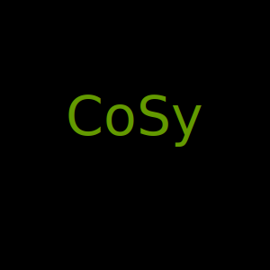

# CoSy

{ role="img" }

|                    |                                                                                                                                                                                                            |
|--------------------|------------------------------------------------------------------------------------------------------------------------------------------------------------------------------------------------------------|
| Package            |                      |
| License            |                                                                    |
| Coverage           |                                             |
| Typed/Type-Checked |       |
| Linted/Formatted   |  |
| Managed with       |                                                                           |

-   :material-clock-fast:{ .lg .middle } __Start synthesizing__

    ---

    Install [`combinatory-synthesizer`](https://pypi.org/project/combinatory-synthesizer/) 
    with [`pip`](https://pypi.org/project/pip/), 
    read an example, 
    and begin synthesizing, all in a few minutes. 

    [:material-arrow-right-box: Quick Start](quick-start.md)  

-   :material-code-tags:{ .lg .middle } __Specify concisely__

    ---

    Use the powerful constraint system of [`CoSy`](https://github.com/tudo-seal/cosy-draft) to generate 
    only the most relevant solutions.  

    [:material-arrow-right-box: Constraints](features/constraints.md) 

-   :material-dna:{ .lg .middle } __Discover advanced features__

    ---

    Learn how users familiar with combinatory logic synthesis can access 
    [`CoSy`](https://github.com/tudo-seal/cosy-draft)'s internals to precisely control synthesis. 

    [:material-arrow-right-box: Advanced](features/advanced.md)

-   :material-school:{ .lg .middle } __Look at examples__

    ---

    Browse a wide selection of examples to kick-start development of your own synthesis projects. 

    [:material-arrow-right-box: Examples](examples/introduction.md)

-   :material-check-bold:{ .lg .middle } __Understand best practices__

    ---

    Understand how to model different types of problems to best capitalize on the performance enhancements of 
    [`CoSy`](https://github.com/tudo-seal/cosy-draft). 

    [:material-arrow-right-box: Best Practice](guidelines/best-practice.md)

-   :material-alert-circle:{ .lg .middle } __Troubleshoot common errors__

    ---

    Find out how to avoid and debug common sources of errors and unexpected behaviour during development.  

    [:material-arrow-right-box: Troubleshoot](guidelines/troubleshoot.md)

-----

## About
This is just a suggestion text. 

**CoSy** is short for **Co**mbinatory **Sy**nthesizer. 
It is an easy to use, comfortable, even cosy, framework that allows synthesizing target artifacts from modular compontents. 
Due to the domain-agnostic nature of the framework (while implemented in python, arbitrary artifacts can be created), 
it is by-and-large applicable to any use-case that benefits or inherently makes use of modularization. 

## Papers
There is a large body of work concerning combinatory logic synthesis, utilizing CoSy (formerly known as the CLS-framework). 
It has been utilized for robotics, logistics, CAD assemblies, factory planning, and many more. 
An overview over relevant literature, split into applications of CoSy and the theory behind it, is found in the following.
### Applications

### Theory